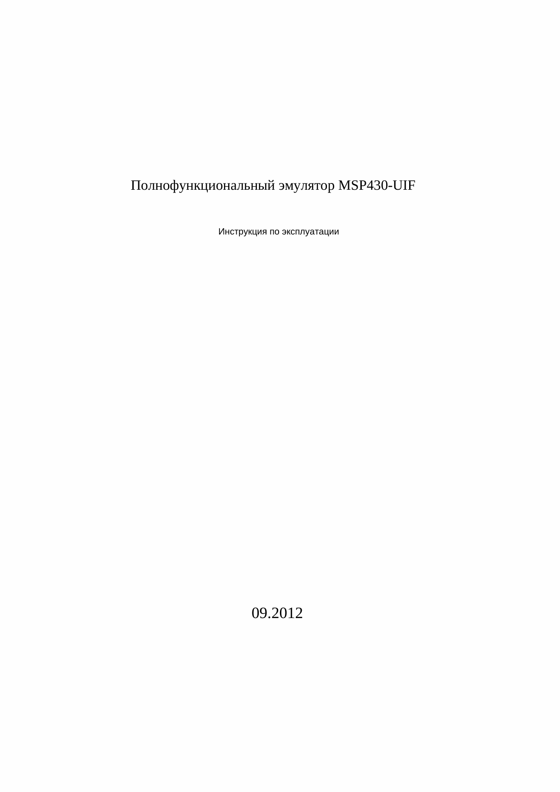

<div align="center">

# 📄 pdf-translate

**Translate technical PDFs. Keep every line exactly where it belongs.**

[](https://www.python.org/downloads/)
[](LICENSE)
[](https://github.com/OwO-Network/DeepLX)
[](https://github.com/pymupdf/PyMuPDF)
[](http://makeapullrequest.com)
[](https://github.com/kostyk348/pdf-translate/actions/workflows/ci.yml)

<p align="center">
  <i>Chinese → Russian · English → Russian · 30+ language pairs · No API key · No broken layout</i>
</p>

```
                  ╔══════════════════════════╗
                  ║      pdf-translate       ║
                  ║  Layout-Preserving PDF   ║
                  ║      Translation         ║
                  ╚══════════════════════════╝
                          │
     ┌────────────────────┼────────────────────┐
     │                    │                    │
  ┌──▼──┐           ┌────▼────┐          ┌────▼───┐
  │SENSE│ ────────> │  LOGIC  │ ───────> │CAUSALI-│
  │parse│  extract  │ DeepLX  │  redact+ │  TY    │
  │ PDF │   lines   │translate│  insert  │output  │
  └─────┘           └─────────┘          └────────┘
                          │                    │
                          │                    ▼
                          │            ┌────────────┐
                          └────────────│audit.json  │
                                       │hash‑chain  │
                                       └────────────┘
```

</div>

---

## ✨ Features

| Capability | Description |
|---|---|
| **Layout‑perfect** | Every line keeps its original position, rotation, font and size. No wrapping, no clipping. |
| **Rotated text** | Handles 0°, 90°, 180°, 270°, -90° — even mixed on the same page. |
| **No API key** | Uses [DeepLX](https://github.com/OwO-Network/DeepLX) — a free, reverse‑engineered DeepL endpoint. |
| **Auto CJK** | Detects Chinese/Japanese/Korean characters and switches source language automatically. |
| **No white rectangles** | Redacts original text with `fill=None` — underlying drawings stay visible. |
| **Overflow guard** | Long translations are repositioned to stay within page boundaries. |
| **Audit trail** | Every step is cryptographically chained in a hash‑based audit log. |
| **Image OCR** | Optional OCR for text inside embedded images (`--ocr`). |
| **Self‑booting** | Creates its own venv on first run — zero manual setup. |

---

## 🎬 Demo

Translating MSP430-UIF JTAG emulator documentation (Chinese → Russian):

<p align="center">
  
</p>

| File | Description |
|---|---|
| [`demo-files/msp430uif-zh.pdf`](demo-files/msp430uif-zh.pdf) | Original (Chinese) |
| [`demo-files/msp430uif-ru.pdf`](demo-files/msp430uif-ru.pdf) | Translated (Russian) |

---

## 🚀 Quick start

### Linux

```bash
# Requirements
sudo apt install fonts-liberation python3 python3-venv

# Grab it
git clone https://github.com/kostyk348/pdf-translate.git
cd pdf-translate

# Translate a Chinese technical drawing to Russian
./pdf-translate.py input.pdf output-ru.pdf -f zh -t ru
```

### Windows

```powershell
# Requirements: Python 3.10+ installed and in PATH

# Grab it
git clone https://github.com/kostyk348/pdf-translate.git
cd pdf-translate

# Translate (use python directly — no shebang on Windows)
python pdf-translate.py input.pdf output-ru.pdf -f zh -t ru
```

> **Note:** On Windows, use `python pdf-translate.py` instead of `./pdf-translate.py`.
> The auto-venv bootstrap creates `.venv\Scripts\` (not `.venv/bin/`).

On first run it automatically:
1. Creates a Python virtual environment
2. Installs PyMuPDF + Pillow
3. Downloads the DeepLX binary
4. Starts the DeepLX translation server

**No `pip install`, no `npm install`, no Docker, no API signup.**

---

## 📖 Usage

### Linux / macOS

```bash
# Chinese → Russian (auto-detects CJK, `-f` optional)
./pdf-translate.py drawing.pdf ru.pdf -f zh -t ru

# English → Russian
./pdf-translate.py manual.pdf manual-ru.pdf -f en -t ru

# Verify integrity with hash‑chain audit
./pdf-translate.py doc.pdf doc-de.pdf -f en -t de --verify

# Specific page range
./pdf-translate.py doc.pdf out.pdf -f zh -t ru --page 3-7

# With image OCR
./pdf-translate.py scan.pdf scan-ru.pdf --ocr

# Disable auto‑language detection
./pdf-translate.py doc.pdf out.pdf -f zh -t ru --no-auto-lang
```

### Windows

```powershell
# Same commands, but with `python pdf-translate.py` prefix
python pdf-translate.py drawing.pdf ru.pdf -f zh -t ru
python pdf-translate.py manual.pdf manual-ru.pdf -f en -t ru
python pdf-translate.py doc.pdf doc-de.pdf -f en -t de --verify
python pdf-translate.py doc.pdf out.pdf -f zh -t ru --page 3-7
python pdf-translate.py scan.pdf scan-ru.pdf --ocr
```

### JSON workflow (offline / external translation)

Translate PDFs in three steps — parse, translate externally, rebuild:

**Linux / macOS:**
```bash
./pdf-translate.py input.pdf --export-json lines.json -f zh -t ru
./pdf-translate.py --translate-json lines.json
./pdf-translate.py input.pdf output.pdf --import-json lines.json
```

**Windows:**
```powershell
python pdf-translate.py input.pdf --export-json lines.json -f zh -t ru
python pdf-translate.py --translate-json lines.json
python pdf-translate.py input.pdf output.pdf --import-json lines.json
```

The JSON file contains every line with position, font, rotation metadata.
You can translate it with DeepLX, edit translations by hand, or feed it to
any external translation pipeline — then import back to rebuild the PDF.

```json
{
  "meta": { "source_lang": "zh", "target_lang": "ru", "total_lines": 46 },
  "lines": [
    {
      "key": [0, 0, 0],
      "page_num": 0,
      "bbox": [100.0, 200.0, 300.0, 215.0],
      "text": "原文字",
      "translated": "переведённый текст",
      "font": "Arial",
      "size": 12.0,
      "color": 0,
      "flags": 0,
      "dir": [1.0, 0.0],
      "angle": 0.0
    }
  ]
}
```

### Arguments

| Arg | Default | Description |
|---|---|---|
| `-f, --from` | `en` | Source language (ZH, EN, RU, DE, FR, etc.) |
| `-t, --to` | `ru` | Target language |
| `--page` | all | Page range, e.g. `1-5` or `1,3,5` |
| `--ocr` | off | OCR text in embedded images |
| `--verify` | off | Verify hash‑chain audit log after translation |
| `--no-auto-lang` | off | Skip automatic CJK detection |
| `--export-json FILE` | — | Export parsed lines to JSON (stops after SENSE+FACT) |
| `--import-json FILE` | — | Import pre-translated JSON, skip LOGIC |
| `--translate-json FILE` | — | Translate JSON file in-place via DeepLX (standalone) |

---

```
[pipeline] en → ru  |  FR0108-1 电热管.pdf
[sense] Parsing PDF...  1 pages, 46 lines, 39 rotated
[logic] Translating 46 lines (zh→ru)...
[causality] Rebuilding PDF layout...
[output] FR0108-1 电热管 (ru).pdf  (320 KB)
[pipeline] Done.
```

> **Result**: a drop‑in replacement — open it in any PDF viewer and every label, dimension, and note is in Russian at the exact same position as the original.

---

## 🔧 How it works

```
 ┌─────────┐   ┌──────────────┐   ┌──────────────────┐   ┌──────────┐
 │  SENSE  │──>│     FACT     │──>│      LOGIC       │──>│CAUSALITY │
 │ parse   │   │ extract      │   │ DeepLX translate │   │ redact   │
 │ structure│   │ lines+spans  │   │ per-line, retry  │   │ +insert  │
 └─────────┘   └──────────────┘   └──────────────────┘   └─────┬────┘
                                                                │
                                                           ┌────▼────┐
                                                           │VERIFIER │
                                                           │ audit   │
                                                           │ chain   │
                                                           └─────────┘
```

**SENSE** — Reads the PDF with PyMuPDF, extracts text blocks, lines, and spans with full positioning metadata (bbox, rotation, font, size).  
**FACT** — Filters, deduplicates, and sorts lines into a canonical ordered list.  
**LOGIC** — Sends each line to the DeepLX server for translation. Retries on failure.  
**CAUSALITY** — Redacts original Chinese text (no white rectangles), inserts translated text at the exact same baseline position with matching rotation.  
**VERIFIER** — Computes a hash chain over the entire translation log and verifies integrity.

---

## 🌐 Supported languages

Any combination supported by DeepL. Common pairs:

| Source | Target |
|---|---|
| Chinese (ZH) | Russian, English, German, French, Japanese, Korean |
| English (EN) | Russian, German, French, Spanish, Italian, Portuguese |
| Japanese (JA) | English, Chinese, Korean |
| Russian (RU) | English, German, French |

Full list: [DeepL docs](https://www.deepl.com/docs-api/translate-text)

---

## 📦 Project structure

```
pdf-translate/
├── pdf-translate.py       # single‑file pipeline (SENSE → ... → VERIFIER)
├── .venv/
│   ├── bin/
│   │   └── deeplx         # Linux: DeepLX translation server (auto‑downloaded)
│   └── Scripts/
│       └── deeplx.exe     # Windows: DeepLX translation server (auto‑downloaded)
├── demo-files/
│   └── msp430uif-demo.gif
├── README.md
├── LICENSE
└── requirements.txt
```

---

## 💬 Why pdf-translate?

Existing tools either:
- Use paid APIs (Google Cloud, AWS Translate)
- Ruin the layout (wrapping, missing rotated text, white rectangles over drawings)
- Require complex Docker setup
- Have no audit trail

**pdf-translate** solves all of these in a single self‑contained Python script.

---

## 🤝 Contributing

PRs are very welcome! Ideas:

- Multiprocessing for large documents
- GUI / web frontend
- More translation backends (LibreTranslate, local LLM)
- macOS auto‑bootstrap support

Check [open issues](https://github.com/kostyk348/pdf-translate/issues) for planned work.

---

## ⭐ Support

If this saved you time, **star the repo**! It helps others find it.

[](https://github.com/kostyk348/pdf-translate)

---

## 📄 License

MIT — do whatever you want, just don't blame us.
